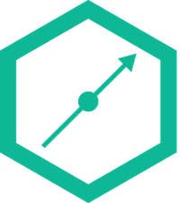

[![Contributors][contributors-shield]][contributors-url]
[![Forks][forks-shield]][forks-url]
[![Stargazers][stars-shield]][stars-url]
[![Issues][issues-shield]][issues-url]
[![MIT License][license-shield]][license-url]
[![LinkedIn][linkedin-shield]][linkedin-url]

<!-- PROJECT LOGO -->
<br />
<p align="center">
  <a href="https://github.com/alvaroserrrano/GS-PhoneCatalog">
    
  </a>

  <h3 align="center">PHONE CATALOG</h3>

  <p align="center">
    REACT - Phone Catalog
    <br />
    <a href="https://github.com/alvaroserrrano/GS-PhoneCatalog"><strong>Explore the docs »</strong></a>
    <br />
    <br />
    <a href="https://github.com/alvaroserrrano/GS-PhoneCatalog">View Demo</a>
    ·
    <a href="https://github.com/alvaroserrrano/GS-PhoneCatalog/issues">Report Bug</a>
    ·
    <a href="https://github.com/alvaroserrrano/GS-PhoneCatalog/issues">Request Feature</a>
  </p>
</p>

<!-- TABLE OF CONTENTS -->

## Table of Contents

- [About the Project](#about-the-project)
  - [Built With](#built-with)
- [Getting Started](#getting-started)
  - [Prerequisites](#prerequisites)
  - [Installation](#installation)
- [Usage](#usage)
- [Roadmap](#roadmap)
- [Contributing](#contributing)
- [License](#license)
- [Contact](#contact)
- [Acknowledgements](#acknowledgements)

<!-- ABOUT THE PROJECT -->

## About The Project

<!-- [![Product Name Screen Shot][product-screenshot]](https://example.com) -->

### Built With

- [ReactJS](https://reactjs.org)
- [Javascript]()
- []()

<!-- GETTING STARTED -->

## Getting Started

To get a local copy up and running follow these simple steps.

### Prerequisites

This is an example of how to list things you need to use the software and how to install them.

- npm

```sh
npm install npm@latest -g
```

- [Docker](https://docs.docker.com/install/)

### Installation

1. Clone the repo

```sh
git clone https://github.com/alvaroserrrano/GS-PhoneCatalog.git
```

2. Install NPM packages

```sh
npm install
```

## Docker

### Build image

```
$ docker build -t aserranorivas/phone-catalog .
```

### Run container

```
$ docker run -p 49160:8080 aserranorivas/phone-catalog
```

### Test the app

```
$ npm run test
```

<!-- THE PROBLEM -->

## REST API

- Provides phones' information
- It should have at least one endpoint
  - Method: GET
  - Path: /phones
  - Response body example:
  ```
  [
  {
      "id": 0,
      "name": "iPhone 7",
      "manufacturer": "Apple",
      "description": "lorem ipsum dolor sit amet consectetur",
      "color": "black",
      "price": 769,
      "imageFileName": "iPhone_7.png",
      "screen": "4,7 inch IPS",
      "processor": "A10 Fusion",
      "ram": 2
  },
  ...
  ]
  ```

## FRONTEND

- The look and feel should not be super sophisticated but it should be decent and somehow responsive so that it doesn't look terrible on a mobile phone
- The home page should display the list of phones. Make sure to display images of them
- It should be possible to select a given phone and obtain the phone details view displaying a few more info about that phone.
- The phone's information should be retrieved from the above described API.
- There should be a spinner or placeholder component while the REST API request is ongoing and the app is waiting for phones data.

## Roadmap

See the [open issues](https://github.com/alvaroserrrano/GS-PhoneCatalog/issues) for a list of proposed features (and known issues).

<!-- CONTRIBUTING -->

## Contributing

Contributions are what make the open source community such an amazing place to be learn, inspire, and create. Any contributions you make are **greatly appreciated**.

1. Fork the Project
2. Create your Feature Branch (`git checkout -b feature/AmazingFeature`)
3. Commit your Changes (`git commit -m 'Add some AmazingFeature'`)
4. Push to the Branch (`git push origin feature/AmazingFeature`)
5. Open a Pull Request

<!-- LICENSE -->

## License

Distributed under the MIT License. See `LICENSE` for more information.

<!-- CONTACT -->

## Contact

Your Name - [@alvaro-serrano-rivas](https://linkedin.com/alvaro-serrano-rivas) - alvaro.serrano@wmich.edu

Project Link: [https://github.com/alvaroserrrano/GS-PhoneCatalog](https://github.com/alvaroserrrano/GS-PhoneCatalog)

<!-- ACKNOWLEDGEMENTS -->

## Acknowledgements

- [GitHub Emoji Cheat Sheet](https://www.webpagefx.com/tools/emoji-cheat-sheet)
- [Img Shields](https://shields.io)
- [Choose an Open Source License](https://choosealicense.com)

<!-- MARKDOWN LINKS & IMAGES -->
<!-- https://www.markdownguide.org/basic-syntax/#reference-style-links -->

[contributors-shield]: https://img.shields.io/github/contributors/alvaroserrrano/repo.svg?style=flat-square
[contributors-url]: https://github.com/alvaroserrrano/repo/graphs/contributors
[forks-shield]: https://img.shields.io/github/forks/alvaroserrrano/repo.svg?style=flat-square
[forks-url]: https://github.com/alvaroserrrano/repo/network/members
[stars-shield]: https://img.shields.io/github/stars/alvaroserrrano/repo.svg?style=flat-square
[stars-url]: https://github.com/alvaroserrrano/repo/stargazers
[issues-shield]: https://img.shields.io/github/issues/alvaroserrrano/repo.svg?style=flat-square
[issues-url]: https://github.com/alvaroserrrano/repo/issues
[license-shield]: https://img.shields.io/github/license/alvaroserrrano/repo.svg?style=flat-square
[license-url]: https://github.com/alvaroserrrano/repo/blob/master/LICENSE.txt
[linkedin-shield]: https://img.shields.io/badge/-LinkedIn-black.svg?style=flat-square&logo=linkedin&colorB=555
[linkedin-url]: https://linkedin.com/in/alvaroserrano
